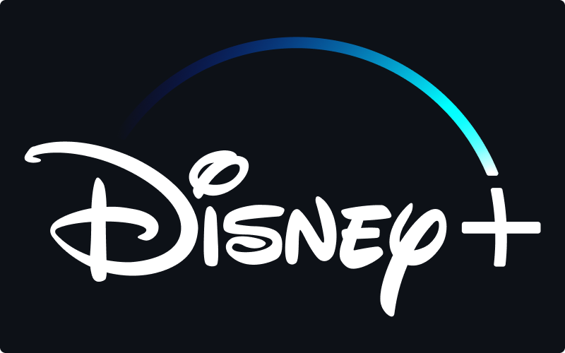

# Disney Plus Clone with React

[Live Demo](https://dp-clone-react03-jg.netlify.app/)

_Disclaimer: This project was done for educational purposes only._

## Stack

- React
- Styled Components
- Firebase (Firestore db)

## Features

- Login page for access to the platform.
- Home page with a full-width slider and movies cards for access to movie details.
- Detail page with movie info.
- Movie database made with Firebase firestore. All information for the detail page and images is provided by the database.

## Getting Started with Create React App

This project was bootstrapped with [Create React App](https://github.com/facebook/create-react-app).

### Available Scripts

In the project directory, you can run:

#### `npm install`

#### `npm start`
